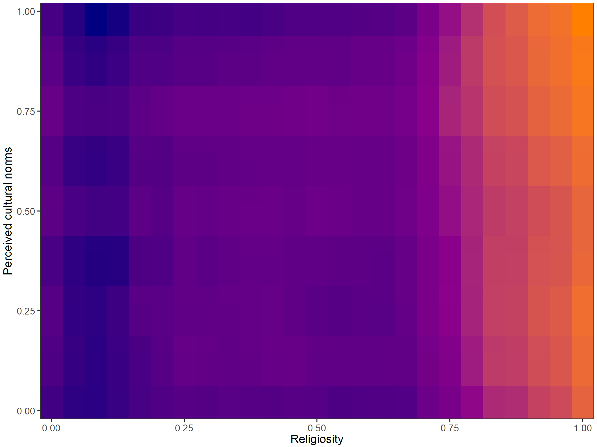

```{r setup, include=FALSE}
library("worcs")
run_everything = FALSE
knitr::opts_chunk$set(echo = FALSE, message = FALSE, warning = FALSE, results = "hide")
fit_table <- function(...){
  dots <- list(...)
  cl <- match.call()[-1]
  m_names <- names(cl)
  if(is.null(m_names)){
    m_names <- as.character(cl)
  } else {
    m_names[which(m_names == "")] <- as.character(cl)[which(m_names == "")]
  }
  out <- data.frame(t(sapply(dots, fitmeasures, fit.measures = c("npar", "chisq", "df", "bic", "rmsea", "cfi", "tli"))))
  row.names(out) <- NULL
  cbind(Model = m_names, out)
}
```

This manuscript uses the Workflow for Open Reproducible Code in Science [@vanlissaWORCSWorkflowOpen2020] to ensure reproducibility and transparency. All code <!--and data--> are available at www.github.com/cjvanlissa/manyanalysts_religion.


We set out to address these research questions:

**a.	Do religious people have higher well-being?**

This RQ can only be answered straightforwardly if there is no interaction between religiosity and perceived cultural norms.

**b.	Does the relationship between religiosity and well-being depend on perceived cultural norms of religion?**

This research question must actually be answered first.
If the answer is yes, then RQ 3a is a moot point; the effect then depends on perceived cultural norms.

## Hypotheses

I had no specific hypotheses. Instread, I set out to perform and interpret two-tailed tests of the random intercept and slope of the effects of 1) the interaction between religiosity and perceived cultural norms (RQ 3b) and 2) religiosity on well-being. The random slopes indicate whether these effects vary across countries.

# Method

To make the project fully reproducible, we used the Workflow for Open Reproducible Code in Science (WORCS; Van Lissa et al., 2020).
We used single imputation using random forests, using the `missForest` algorithm by Stekhoven & Bühlmann (2012), in the `missRanger` implementation.

```{r loaddata}
library(worcs)
library(missRanger)
library(MplusAutomation)
library(tidySEM)
library(tuneRanger)
library(ranger)
library(metaforest)
library(lavaan)
# Load data
if(isTRUE(tools::md5sum("df_analyze.RData") == "a41429323622702faf12be4dfc3a192b")){
  df <- readRDS("df_analyze.RData")
} else {
  load_data()
  
  # Set aside testing sample for unbiased evaluation of model fit
  set.seed(893)
  train <- sample(1:nrow(df), size = floor(.70*nrow(df)))
  df_test <- df[-train, ]
  df <- df[train, ]
  
  # Remove failed attention check
  df <- df[df$attention_check == 1, ]
  
  # Impute missings
  df <- missRanger(df)
  saveRDS(df, "df_analyze.RData")
}

df$rel_3 <- c(1, 0)[df$rel_3 + 1]
```


## Measures

We had originally intended to use latent variables for wellbeing, religiosity, and perceived cultural norms.
However, we experienced recurrent problems with model convergence when including measurement models (CFAs) for these variables.
We therefore decided to use 

### Dependent variable

For the dependent variable wellbeing, we compared a one-factor model to a three-factor model. 
We preregistered a preference for the simpler one-factor model if the fit of both models was approximately equal.

```{r cfawell, results = "asis"}
cfa_well <- "well =~ wb_phys_1 + wb_phys_2 + wb_phys_3 + wb_phys_4 + wb_phys_5
+ wb_phys_6 + wb_phys_7 + wb_psych_1 + wb_psych_2 + wb_psych_3 + wb_psych_4
+ wb_psych_5 + wb_psych_6 + wb_soc_1 + wb_soc_2 + wb_soc_3
"
fit_cfa_well <- cfa(cfa_well, df)
cfa_well3 <- "phys =~ wb_phys_1 + wb_phys_2 + wb_phys_3 + wb_phys_4 + wb_phys_5
+ wb_phys_6 + wb_phys_7 
psych =~ wb_psych_1 + wb_psych_2 + wb_psych_3 + wb_psych_4  + wb_psych_5 +
wb_psych_6
soc =~ wb_soc_1 + wb_soc_2 + wb_soc_3"
fit_cfa_well3 <- cfa(cfa_well3, df)
knitr::kable(fit_table(fit_cfa_well, fit_cfa_well3), digits = 3)
```

We found that the fit of both models was unacceptable.
As we also experienced recurrent problems with model convergence when using measurement models (CFAs) in the SEM models, we decided to use mean scale scores for all variables.
Moreover, the factor loadings of the first two physical wellbeing items were very low.
This makes theoretical sense, as these have to do with physical disability/disease.
We decided to omit them.
 <!--For convenience purposes, we proceed with the one-factor model. We use modification indices to improve the fit.-->

```{r, echo=FALSE, eval = FALSE}
dec <- "*epc:m*"
i = 1
while(i < 100 | !grepl("nm", dec, fixed = TRUE)){
  fit_cfa_well <- cfa(cfa_well, df)
  mi <- modificationindices(fit_cfa_well, sort. = TRUE, minimum.value = 3, power = TRUE)
  dec <- mi[1, ]$decision
  if(!grepl("nm", dec, fixed = TRUE)){
    cfa_well <- paste0(cfa_well, "\n", paste0(mi[1, 1:3], collapse = " "), collapse = "")
  }
  i <- i + 1
}
cfa_well_mplus <- gsub("=~", "BY", cfa_well, fixed = TRUE)
cfa_well_mplus <- gsub("\\n", " ", cfa_well_mplus, fixed = TRUE)
cfa_well_mplus <- gsub(" + ", ";\nwell BY ", cfa_well_mplus, fixed = TRUE)
cfa_well_mplus <- gsub("+ ", ";\nwell BY ", cfa_well_mplus, fixed = TRUE)
cfa_well_mplus <- gsub("soc_3", "soc_3;", cfa_well_mplus, fixed = TRUE)
cfa_well_mplus <- gsub("~~", "WITH", cfa_well_mplus, fixed = TRUE)
cfa_well_mplus <- gsub("(?<!;)\\n", ";\\\n", cfa_well_mplus, perl = TRUE)
cfa_well_mplus <- gsub("\\n;\\n", "\\\n", cfa_well_mplus, perl = TRUE)
```

###	Predictor variable(s)

For the main predictor, religiosity, we conducted parallel analysis to determine the dimensionality of the construct. If parallel analysis suggests >1 factors, we will conduct an EFA for the suggested number of factors, and construct a CFA model based on the pattern of factor loadings. We will then compare a one-factor model to the EFA-based model. 
We would prefer a simpler one-factor model, but if the fit of the EFA-based model is notably better (subjective decision), we will treat the subscales of religiosity as separate IVs. 

Note that we removed the categorical items `rel_3` and `rel_4`, because these caused problems with estimation in Mplus.

```{r cfarel, echo = FALSE}
cfa_rel <- "religiosity =~ rel_1 + rel_2 + rel_5 + rel_6 + rel_7 + rel_8 + rel_9"
fit <- cfa(cfa_rel, df)
fit_table(religiosity = fit)
library(psych)
fa.parallel(df[, grep("^rel_[1-9]$", names(df))], fa = "fa")
res <- fa(df[, grep("^rel_[1-9]$", names(df))], nfactors = 3)
print(res, cut = .4)
```

Parallel analysis suggested 3 factors, but only one factor has high loadings (and explains `r report(res$Vaccounted[4,1], equals = FALSE)` of the variance in the items).

The loadings of the two dichotomous items are lowest. We decided to remove these items, also because they caused difficulties in estimating the models in Mplus. This deviation from the preregistration is documented in `changes.txt`.

For the variable `cnorm`, we just use a latent variable with two indicators.

## Mean scale scores

Due to problems in model convergence when using measurement models, we resorted to using mean scale scores for all variables.
As can be seen in the table below, all three scales had good-to-excellent reliability,
and had factor loadings $\geq .48$ on a single-factor CFA.

```{r scale_scores, warning = FALSE, message=FALSE}
library(tidySEM)
df_score <- df
dict <- tidy_sem(df)
dict$dictionary$scale[c(5:6, 16:17, 32:47)] <- NA
dict$dictionary$scale <- gsub("^wb_(gen|phys|psych|soc)$", "well", dict$dictionary$scale)
scalescores <- tidySEM::create_scales(dict)
scale_tab <- scalescores$descriptives
scalescores <- scale(scalescores$scores, scale = FALSE)
df_score <- cbind(df_score, scalescores)
df_score$int <- df_score$rel * df_score$cnorm
```

```{r tabscale, results = "asis"}
scale_tab$Items <- as.integer(scale_tab$Items)
scale_tab$n <- as.integer(scale_tab$n)
knitr::kable(scale_tab[c("Subscale", "Items", "n", "mean", "sd", "min", "max", "skew", "kurt", "Reliability", "Interpret", "min_load", "max_load")])
```

# Analyses

We first split the data into a 70% training sample and 30% testing sample using the preregistered random seed.
As preregistered, we used training sample to make necessary adjustments to the planned analyses.
These changes are documented in `changes.txt`.
After the definitive models have been developed using the training sample,
the testing sample will be used only to obtain unbiased estimates of model fit.
This prevents us from overfitting or p-hacking the training sample.

First, we definitively decided upon the set of models to be compared based on the training sample.
We encountered repeated problems with model convergence for the planned models.
We solved this problem by using mean scale scores as observed variables in all analyses. <!--switching to a Bayesian estimator with uninformative priors (a pragmatic use of Bayesian estimation).
Interpretation of Bayesian parameter estimates differs from maximum likelihood estimates.
We report the posterior median, and a 95% highest posterior density interval (HPDI). This is the "narrowest" possible interval that contains 95% of samples from the posterior distribution. It represents the most likely population values of the parameter in question. Results are best interpreted by examining the effect size (correlations and standardized regression coefficients), and the width of the HPDI.
Significance is not a Bayesian concept, but we use the shorthand "significant" to refer to estimates for which less than 5% of the posterior distribution had the opposite sign from the estimate.-->

<!--### Model fit indices were not available for some of the planned models

For some models, the only available fit index was the DIC.
For random slope models, not even the DIC was available.
It was possible to estimate parametric models when omitting the measurement model (all CFAs).
Thus, to select the final model as planned in the preregistration,
we calculated mean scores for all latent variables, and we estimated a set of multilevel path models approximately corresponding to the planned multilevel SEM models.
We selected the best model from the set as our final model,
and then returned to Bayesian estimation for the final model.-->

## Selecting the final model

```{r mplus_scales, echo = FALSE, results="hide", warning=FALSE, message=FALSE}
library(MplusAutomation)
run_scale_models <- run_everything

if(run_scale_models | !file.exists("m1_scale.out")){
  syn_m1_scale <- c(
    "%WITHIN%",
    "well ON age;",
    "well ON gender;",
    "well ON ses;",
    "well ON education;",
    "well ON majority;",
    "%BETWEEN%",
    "[well];"
  )
  #298705.124
  m1_scale <- mplusObject(TITLE = "M1_scale",
                          VARIABLE = paste0(c(
                            "WITHIN = age gender ses education majority",
                            ";",
                            "CLUSTER IS country;"
                          ), collapse = "\n"),
                          ANALYSIS = c("TYPE = TWOLEVEL RANDOM;"
                          ),
                          MODEL = syn_m1_scale,
                          #OUTPUT = "stdyx;",
                          rdata = df_score)
  res_m1_scale <- mplusModeler(m1_scale, modelout = "m1_scale.inp", run = 1L)$results
} else {
  res_m1_scale <- readModels("m1_scale.out")
}

if(run_scale_models | !file.exists("m2_scale.out")){
  syn_m2_scale <- c(
    "%WITHIN%",
    "sreli | well ON rel;",
    "snorm | well ON cnorm;",
    "well ON age;",
    "well ON gender;",
    "well ON ses;",
    "well ON education;",
    "well ON majority;",
    
    "%BETWEEN%",
    "[well];",
    "[sreli];",
    "[snorm];",
    "sreli;",
    "snorm;"
  )
  
  m2_scale <- mplusObject(TITLE = "M2_scale",
                          VARIABLE = paste0(c(
                            "WITHIN = age gender ses education majority",
                            "rel",
                            "cnorm",
                            ";",
                            "CLUSTER IS country;"
                          ), collapse = "\n"),
                          ANALYSIS = c("TYPE = TWOLEVEL RANDOM;"),
                          MODEL = syn_m2_scale,
                          rdata = df_score)
  
  res_m2_scale <- mplusModeler(m2_scale, modelout = "m2_scale.inp", run = 1L)$results
} else {
  res_m2_scale <- readModels("m2_scale.out")
}

if(run_scale_models | !file.exists("m2fx_scale.out")){
  syn_m2fx_scale <- c(
    "%WITHIN%",
    "sreli | well ON rel;",
    "snorm | well ON cnorm;",
    "well ON age;",
    "well ON gender;",
    "well ON ses;",
    "well ON education;",
    "well ON majority;",
    
    "%BETWEEN%",
    "[well];",
    "sreli@0;",
    "snorm@0;"
  )
  
  m2fx_scale <- mplusObject(TITLE = "M2fx_scale",
                            VARIABLE = paste0(c(
                              "WITHIN = age gender ses education majority",
                              "rel",
                              "cnorm",
                              ";",
                              "CLUSTER IS country;"), collapse = "\n"
                            ),
                            ANALYSIS = c("TYPE = TWOLEVEL RANDOM;"),
                            MODEL = syn_m2fx_scale,
                            rdata = df_score)
  
  res_m2fx_scale <- mplusModeler(m2fx_scale, modelout = "m2fx_scale.inp", run = 1L)$results
} else {
  res_m2fx_scale <- readModels("m2fx_scale.out")
}

if(run_scale_models | !file.exists("m3_scale.out")){
  syn_m3_scale <- c(
    "%WITHIN%",
    "sreli | well ON rel;",
    "snorm | well ON cnorm;",
    "sint | well ON int;",
    "well ON age;",
    "well ON gender;",
    "well ON ses;",
    "well ON education;",
    "well ON majority;",
    
    "%BETWEEN%",
    "[well];",
    "[sreli];",
    "[snorm];",
    "[sint];",
    "sreli;",
    "snorm;",
    "sint;"
  )
  
  m3_scale <- mplusObject(TITLE = "M3_scale",
                          VARIABLE = paste0(c(
                            "WITHIN = age gender ses education majority",
                            "rel",
                            "cnorm",
                            "int;",
                            "CLUSTER IS country;"), collapse = "\n"
                          ),
                          ANALYSIS = c("TYPE = TWOLEVEL RANDOM;"),
                          MODEL = syn_m3_scale,
                          OUTPUT = "TECH3;",
                          rdata = df_score)
  
  res_m3_scale <- mplusModeler(m3_scale, modelout = "m3_scale.inp", run = 1L)$results
} else {
  res_m3_scale <- readModels("m3_scale.out")
}

if(run_scale_models | !file.exists("m3fx_scale.out")){
  syn_m3fx_scale <- c(
    "%WITHIN%",
    "sreli | well ON rel;",
    "snorm | well ON cnorm;",
    "sint | well ON int;",
    "well ON age;",
    "well ON gender;",
    "well ON ses;",
    "well ON education;",
    "well ON majority;",
    
    "%BETWEEN%",
    "[well];",
    "sreli@0;",
    "snorm@0;",
    "sint@0;"
  )
  
  m3fx_scale <- mplusObject(TITLE = "M3fx_scale",
                            VARIABLE = paste0(c(
                              "WITHIN = age gender ses education majority",
                              "rel",
                              "cnorm",
                              "int;",
                              "CLUSTER IS country;"), collapse = "\n"
                            ),
                            ANALYSIS = c("TYPE = TWOLEVEL RANDOM;"),
                            
                            MODEL = syn_m3fx_scale,
                            rdata = df_score)
  
  res_m3fx_scale <- mplusModeler(m3fx_scale, modelout = "m3fx_scale.inp", run = 1L)$results
} else {
  res_m3fx_scale <- readModels("m3fx_scale.out")
}

results <- mget(grep("^res_.+scale", ls(), value = TRUE))

tmp <- MplusAutomation::SummaryTable(results, sortBy = "Title", keepCols = c("Title", "Parameters", "LL", "LLCorrectionFactor", "AIC", "BIC"), type = "none")

tmp$Title <- gsub("(\\d)_scale", "\\1 free", tmp$Title)
tmp$Title <- gsub("fx_scale", " fixed", tmp$Title)
tmp <- tmp[order(tmp$Parameters), ]

```

As per the preregistered procedure,
we first developed a series of models to fit using the training sample.
We allowed some researcher degrees of freedom to account for unforeseen problems,
as described above.


## Validation

```{r scoresvalidate, echo = FALSE, results="hide", warning=FALSE, message=FALSE}
run_scale_test_models <- run_everything

if(isTRUE(tools::md5sum("df_test.RData") == "7e002cfedfdcdfc6e8658907b24360e4")){
  df_test <- readRDS("df_test.RData")
} else {
  load_data()
  
  # Set aside testing sample for unbiased evaluation of model fit
  set.seed(893)
  train <- sample(1:nrow(df), size = floor(.70*nrow(df)))
  df_test <- df[-train, ]
  df_test <- df_test[df_test$attention_check == 1, ]
  # Impute missings
  set.seed(3546)
  df_test <- missRanger(df_test)  
  saveRDS(df_test, "df_test.RData")
}
df_score <- df_test
dict <- tidy_sem(df_score)
dict$dictionary$scale[c(5:6, 16:17, 32:47)] <- NA
dict$dictionary$scale <- gsub("^wb_(gen|phys|psych|soc)$", "well", dict$dictionary$scale)
scalescores <- tidySEM::create_scales(dict)
tab_validatescores <- scalescores$descriptives
scalescores <- scale(scalescores$scores, scale = FALSE)
df_score <- cbind(df_score, scalescores)
df_score$int <- df_score$rel * df_score$cnorm
```

Next, we validated these models on the 30% testing sample to obtain unbiased estimates of model fit.
The scale score descriptives of the validation sample were nearly identical to the training sample,
which suggests that our decisions to drop certain items did not lead to overfitting (see table below).

```{r tabscalevalidate, results = "asis"}
tab_validatescores$Items <- as.integer(tab_validatescores$Items)
tab_validatescores$n <- as.integer(tab_validatescores$n)
knitr::kable(tab_validatescores[c("Subscale", "Items", "n", "mean", "sd", "min", "max", "skew", "kurt", "Reliability", "Interpret", "min_load", "max_load")])
```

### Model selection

```{r mplus_scales_validate, echo = FALSE, results="hide", warning=FALSE, message=FALSE}
if(run_scale_test_models | !file.exists("m1_scale_test.out")){
  syn_m1_scale_test <- c(
    "%WITHIN%",
    "well ON age;",
    "well ON gender;",
    "well ON ses;",
    "well ON education;",
    "well ON majority;",
    "%BETWEEN%",
    "[well];"
  )
  #298705.124
  m1_scale_test <- mplusObject(TITLE = "M1_scale_test",
                               VARIABLE = paste0(c(
                                 "WITHIN = age gender ses education majority",
                                 ";",
                                 "CLUSTER IS country;"
                               ), collapse = "\n"),
                               ANALYSIS = c("TYPE = TWOLEVEL RANDOM;"
                               ),
                               MODEL = syn_m1_scale_test,
                               #OUTPUT = "stdyx;",
                               rdata = df_score)
  res_m1_scale_test <- mplusModeler(m1_scale_test, modelout = "m1_scale_test.inp", run = 1L)$results
} else {
  res_m1_scale_test <- readModels("m1_scale_test.out")
}

if(run_scale_test_models | !file.exists("m2_scale_test.out")){
  syn_m2_scale_test <- c(
    "%WITHIN%",
    "sreli | well ON rel;",
    "snorm | well ON cnorm;",
    "well ON age;",
    "well ON gender;",
    "well ON ses;",
    "well ON education;",
    "well ON majority;",
    
    "%BETWEEN%",
    "[well];",
    "[sreli];",
    "[snorm];",
    "sreli;",
    "snorm;"
  )
  
  m2_scale_test <- mplusObject(TITLE = "M2_scale_test",
                               VARIABLE = paste0(c(
                                 "WITHIN = age gender ses education majority",
                                 "rel",
                                 "cnorm",
                                 ";",
                                 "CLUSTER IS country;"
                               ), collapse = "\n"),
                               ANALYSIS = c("TYPE = TWOLEVEL RANDOM;"),
                               MODEL = syn_m2_scale_test,
                               rdata = df_score)
  
  res_m2_scale_test <- mplusModeler(m2_scale_test, modelout = "m2_scale_test.inp", run = 1L)$results
} else {
  res_m2_scale_test <- readModels("m2_scale_test.out")
}

if(run_scale_test_models | !file.exists("m2fx_scale_test.out")){
  syn_m2fx_scale_test <- c(
    "%WITHIN%",
    "sreli | well ON rel;",
    "snorm | well ON cnorm;",
    "well ON age;",
    "well ON gender;",
    "well ON ses;",
    "well ON education;",
    "well ON majority;",
    
    "%BETWEEN%",
    "[well];",
    "[sreli];",
    "[snorm];",
    "sreli@0;",
    "snorm@0;"
  )
  
  m2fx_scale_test <- mplusObject(TITLE = "M2fx_scale_test",
                                 VARIABLE = paste0(c(
                                   "WITHIN = age gender ses education majority",
                                   "rel",
                                   "cnorm",
                                   ";",
                                   "CLUSTER IS country;"), collapse = "\n"
                                 ),
                                 ANALYSIS = c("TYPE = TWOLEVEL RANDOM;"),
                                 MODEL = syn_m2fx_scale_test,
                                 rdata = df_score)
  
  res_m2fx_scale_test <- mplusModeler(m2fx_scale_test, modelout = "m2fx_scale_test.inp", run = 1L)$results
} else {
  res_m2fx_scale_test <- readModels("m2fx_scale_test.out")
}

if(run_scale_test_models | !file.exists("m3_scale_test.out")){
  syn_m3_scale_test <- c(
    "%WITHIN%",
    "sreli | well ON rel;",
    "snorm | well ON cnorm;",
    "sint | well ON int;",
    "well ON age;",
    "well ON gender;",
    "well ON ses;",
    "well ON education;",
    "well ON majority;",
    
    "%BETWEEN%",
    "[well];",
    "[sreli];",
    "[snorm];",
    "[sint];",
    "sreli;",
    "snorm;",
    "sint;"
  )
  
  m3_scale_test <- mplusObject(TITLE = "M3_scale_test",
                               VARIABLE = paste0(c(
                                 "WITHIN = age gender ses education majority",
                                 "rel",
                                 "cnorm",
                                 "int;",
                                 "CLUSTER IS country;"), collapse = "\n"
                               ),
                               ANALYSIS = c("TYPE = TWOLEVEL RANDOM;"),
                               MODEL = syn_m3_scale_test,
                               OUTPUT = "TECH3;",
                               rdata = df_score)
  
  res_m3_scale_test <- mplusModeler(m3_scale_test, modelout = "m3_scale_test.inp", run = 1L)$results
} else {
  res_m3_scale_test <- readModels("m3_scale_test.out")
}

if(run_scale_test_models | !file.exists("m3fx_scale_test.out")){
  syn_m3fx_scale_test <- c(
    "%WITHIN%",
    "sreli | well ON rel;",
    "snorm | well ON cnorm;",
    "sint | well ON int;",
    "well ON age;",
    "well ON gender;",
    "well ON ses;",
    "well ON education;",
    "well ON majority;",
    
    "%BETWEEN%",
    "[well];",
    "[sreli];",
    "[snorm];",
    "[sint];",
    "sreli@0;",
    "snorm@0;",
    "sint@0;"
  )
  
  m3fx_scale_test <- mplusObject(TITLE = "M3fx_scale_test",
                                 VARIABLE = paste0(c(
                                   "WITHIN = age gender ses education majority",
                                   "rel",
                                   "cnorm",
                                   "int;",
                                   "CLUSTER IS country;"), collapse = "\n"
                                 ),
                                 ANALYSIS = c("TYPE = TWOLEVEL RANDOM;"),
                                 
                                 MODEL = syn_m3fx_scale_test,
                                 rdata = df_score)
  
  res_m3fx_scale_test <- mplusModeler(m3fx_scale_test, modelout = "m3fx_scale_test.inp", run = 1L)$results
} else {
  res_m3fx_scale_test <- readModels("m3fx_scale_test.out")
}

results <- mget(grep("^res_.+scale_test", ls(), value = TRUE))

tmp <- MplusAutomation::SummaryTable(results, sortBy = "Title", keepCols = c("Title", "Parameters", "LL", "LLCorrectionFactor", "AIC", "BIC"), type = "none")

tmp$Title <- gsub("(\\d)_scale_test", "\\1 free", tmp$Title)
tmp$Title <- gsub("fx_scale_test", " fixed", tmp$Title)
tmp <- tmp[order(tmp$Parameters), ]
library(ggplot2)
p <- ggplot(data.frame(data.frame(Model = ordered(tmp$Title, levels = tmp$Title),
                                  BIC = tmp$BIC)),
            aes(x = Model, y = BIC)) + geom_path(group = 1) +
  geom_point()  + 
  geom_vline(xintercept = tmp$Title[which.min(tmp$BIC)], linetype = 2) +
  geom_hline(yintercept = tmp$BIC[which.min(tmp$BIC)], linetype = 2) +
  theme_bw()


m <- tmp[1:4, c("Parameters", "LL", "LLCorrectionFactor")]
mp1 <- tmp[2:5, c("Parameters", "LL", "LLCorrectionFactor")]

cd = ((m$Parameters*m$LLCorrectionFactor) - (mp1$Parameters*mp1$LLCorrectionFactor)) / (m$Parameters-mp1$Parameters)
degfree = mp1$Parameters - m$Parameters
TRd = -2*(m$LL - mp1$LL) / cd
tmp$LR_p <- c(NA, formatC(pchisq(TRd, degfree, lower.tail = FALSE), digits = 3, format = "f"))
```

We preregistered that we would select the best-fitting model (in the testing sample) using a combination of BIC statistics,
to rank the models by fit, and likelihood ratio tests.
For the BIC statistic, a lower number indicates better fit.
The preference would thus generally be for the model with the smallest BIC.
However, sometimes the difference between models might be negligible.
Therefore, we complement the BIC with likelihood ratio tests.
If two models both have low BICs, the more parsimoneous model would be preferred.
If this model does not differ significantly from the one with the lowest BIC,
then we will select the more parsimoneous one.

As can be seen in the table below, 
with increasing complexity, fit improved significantly until model `r tail(tmp$Title[tmp$LR_p < .05], 1)`.

```{r tabscalefit, results = "asis"}
options(knitr.kable.NA = '')
knitr::kable(tmp)
```

According to the plot below, BIC similarly indicated that fit improved until model `r tmp$Title[which.min(tmp$BIC)]`. 
Thus, we decided to use `M3 fixed` as our final model.

```{r figbic}
p
```

## Final model

The final model was evaluated on the full sample to obtain as much power as possible,
and the results of that analysis are used for inference.

```{r}
run_final <- run_everything
if(isTRUE(tools::md5sum("df_full.RData") == "61693c94353041848295af602b796e24")){
  df <- readRDS("df_full.RData")
} else {
  df_full <- load_data(to_envir = FALSE)[[1]]
  
  # Remove failed attention check
  df <- df_full[df_full$attention_check == 1, ]
  
  # Impute missings
  set.seed(878)
  df <- missRanger(df)
  saveRDS(df, "df_full.RData")
}
df_score <- df
dict <- tidy_sem(df_score)
dict$dictionary$scale[c(5:6, 16:17, 32:47)] <- NA
dict$dictionary$scale <- gsub("^wb_(gen|phys|psych|soc)$", "well", dict$dictionary$scale)
scalescores <- tidySEM::create_scales(dict)
scalescores <- scale(scalescores$scores, scale = FALSE)
df_score <- cbind(df_score, scalescores)
df_score$int <- df_score$rel * df_score$cnorm

if(run_final | !file.exists("m3fx_final.out")){
  syn_m3fx_final <- c(
    "%WITHIN%",
    "sreli | well ON rel;",
    "snorm | well ON cnorm;",
    "sint | well ON int;",
    "well ON age;",
    "well ON gender;",
    "well ON ses;",
    "well ON education;",
    "well ON majority;",
    
    "%BETWEEN%",
    "[well];",
    "[sreli];",
    "[snorm];",
    "[sint];",
    "sreli@0;",
    "snorm@0;",
    "sint@0;"
  )
  
  m3fx_final <- mplusObject(TITLE = "M3fx_final",
                            VARIABLE = paste0(c(
                              "WITHIN = age gender ses education majority",
                              "rel",
                              "cnorm",
                              "int;",
                              "CLUSTER IS country;"), collapse = "\n"
                            ),
                            ANALYSIS = c("TYPE = TWOLEVEL RANDOM;"),
                            MODEL = syn_m3fx_final,
                            rdata = df_score)
  
  res_m3fx_final <- mplusModeler(m3fx_final, modelout = "m3fx_final.inp", run = 1L)$results
} else {
  res_m3fx_final <- readModels("m3fx_final.out")
}

```


# Results

As preregistered, The general modeling framework is a multilevel model,
because the data are nested (respondents within countries).
Our analyses indicated that the best-fitting model included fixed effects for religiosity, perceived cultural norms, and the interaction between the two.
The best-fitting model did not include random effects for these parameters.
That means that there was no significant variability across countries in these effects.

The structural parameters of the final model are displayed in the table below.

```{r tabparams, results="asis", message=FALSE, warning = FALSE}
tab <- table_results(res_m3fx_final, columns = c("paramheader", "lhs", "op", "rhs", "level", "est_sig", "se", "pval", "confint"))
tab <- tab[!tab$se == "", ]
tab$paramheader <- gsub("^Residual\\.", "", tab$paramheader)
tab$paramheader <- gsub("Variances", "Variance (wellbeing)", tab$paramheader)
tab$paramheader <- gsub("Means", "Mean (wellbeing)", tab$paramheader)
tab$paramheader[match(c("SRELI", "SNORM", "SINT"), tab$lhs)] <- c("RI (Religiosity)", "RI (Perceived norms)", "RI (religiosity * norms)")
tab$paramheader[grepl("\\.ON$", tab$paramheader)] <- paste0("Control (", tolower(tab$rhs[grepl("\\.ON$", tab$paramheader)]), ")")
tab <- tab[, c("paramheader", "level", "est_sig", "se", "pval", "confint")]
tab <- tab[order(tab$level, rev(tab$paramheader)), ]
rownames(tab) <- NULL
names(tab)[1] <- "Parameter"
tab <- tab[match(c("RI (Religiosity)", "RI (Perceived norms)", "RI (religiosity * norms)", 
"Mean (wellbeing)", "Variance (wellbeing)", "Control (majority)", 
"Control (ses)", "Control (gender)", "Control (education)", "Control (age)", 
"Variance (wellbeing)"), tab$Parameter), ]
knitr::kable(tab)
```
With regard to the preregistered research questions, we must first establish whether the relationship between religiosity and well-being depend on perceived cultural norms of religion (research question *b*).
This interaction is significant, thus we conclude that the effect of religiosity on wellbeing is dependent on the perceived cultural norms of religion.

With regard to research question *a*, whether religious people have higher well-being, we conclude that, on average across the sample, religiosity positively predicts wellbeing, $B = `r tab$est_sig[tab$Parameter == "RI (Religiosity)"]`, CI`r tab$confint[tab$Parameter == "RI (Religiosity)"]`$.

Due to the significant interaction between religiosity and perceived cultural norms of religion,
this effect tends to be stronger on average when individuals perceive greater cultural norms of religion, and weaker when participants perceive lower cultural norms.

## Sensitivity check

As preregistered, we conducted a sensitivity analysis, re-running the final model with all participants included.

```{r, echo = FALSE}
run_final <- run_everything
if(isTRUE(tools::md5sum("df_full_sens.RData") == "cdd72194471551951f2c68e674a1363f")){
  df <- readRDS("df_full_sens.RData")
} else {
  df <- load_data(to_envir = FALSE)[[1]]
  # Impute missings
  set.seed(878)
  df <- missRanger(df)
  saveRDS(df, "df_full_sens.RData")
}
df_score <- df
dict <- tidy_sem(df_score)
dict$dictionary$scale[c(5:6, 16:17, 32:47)] <- NA
dict$dictionary$scale <- gsub("^wb_(gen|phys|psych|soc)$", "well", dict$dictionary$scale)
scalescores <- tidySEM::create_scales(dict)
scalescores <- scale(scalescores$scores, scale = FALSE)
df_score <- cbind(df_score, scalescores)
df_score$int <- df_score$rel * df_score$cnorm

if(run_final | !file.exists("m3fx_finalsens.out")){
  m3fx_finalsens <- mplusObject(TITLE = "M3fx_final",
                            VARIABLE = paste0(c(
                              "WITHIN = age gender ses education majority",
                              "rel",
                              "cnorm",
                              "int;",
                              "CLUSTER IS country;"), collapse = "\n"
                            ),
                            ANALYSIS = c("TYPE = TWOLEVEL RANDOM;"),
                            MODEL = syn_m3fx_final,
                            rdata = df_score)
  
  res_m3fx_finalsens <- mplusModeler(m3fx_finalsens, modelout = "m3fx_finalsens.inp", run = 1L)$results
} else {
  res_m3fx_finalsens <- readModels("m3fx_finalsens.out")
}

```
The table below shows the results from the final model, with an extra column added with the 95% confidence intervals for a sensitivity analysis with all participants included (even those who failed the attention check).
Note that these confidence intervals are nearly identical with the original confidence intervals.
We thus conclude that omitting participants with failed attention checks did not meaningfully affect the conclusions of the present study.

```{r tabsens, results="asis", message=FALSE, warning = FALSE}
tab_orig <- tab
tab <- table_results(res_m3fx_finalsens, columns = c("paramheader", "lhs", "op", "rhs", "level", "est_sig", "se", "pval", "confint"))
tab <- tab[!tab$se == "", ]
tab$paramheader <- gsub("^Residual\\.", "", tab$paramheader)
tab$paramheader <- gsub("Variances", "Variance (wellbeing)", tab$paramheader)
tab$paramheader <- gsub("Means", "Mean (wellbeing)", tab$paramheader)
tab$paramheader[match(c("SRELI", "SNORM", "SINT"), tab$lhs)] <- c("RI (Religiosity)", "RI (Perceived norms)", "RI (religiosity * norms)")
tab$paramheader[grepl("\\.ON$", tab$paramheader)] <- paste0("Control (", tolower(tab$rhs[grepl("\\.ON$", tab$paramheader)]), ")")
tab <- tab[, c("paramheader", "level", "est_sig", "se", "pval", "confint")]
tab <- tab[order(tab$level, rev(tab$paramheader)), ]
rownames(tab) <- NULL
names(tab)[1] <- "Parameter"
tab <- tab[match(c("RI (Religiosity)", "RI (Perceived norms)", "RI (religiosity * norms)", 
"Mean (wellbeing)", "Variance (wellbeing)", "Control (majority)", 
"Control (ses)", "Control (gender)", "Control (education)", "Control (age)", 
"Variance (wellbeing)"), tab$Parameter), ]
if(!all(tab$Parameter == tab_orig$Parameter)) stop("error")
tab_orig$"confint sens" <- tab$confint
knitr::kable(tab_orig)
```

# Exploratory analyses

In addition to the planned deductive analyses, we conducted an inductive (exploratory) analysis using random forests, predicting a mean score of wellbeing from the individual-level predictors.
This analysis should reveal what the most important predictors of wellbeing are in the dataset provided, and can therefore help contextualize the planned analyses. Is religion indeed important? Are perceived cultural norms? How important are they, compared to other measured variables?

```{r}
# Random forests ----------------------------------------------------------
library(metaforest)
library(ranger)
library(mlr)
library(tuneRanger)
library(tidySEM)

df_rf <- readRDS("df_full_sens.RData")
dict <- tidy_sem(df_rf)
dict$dictionary$scale[c(5:6, 16:17, 32:47)] <- NA
dict$dictionary$scale <- gsub("^wb_(gen|phys|psych|soc)$", "well", dict$dictionary$scale)
scalescores <- tidySEM::create_scales(dict)
df_rf <- cbind(df_rf, scalescores$scores)

names(df_rf)
df_rf[grepl("((rel|wb|cnorm)_|gdp|subject)", names(df_rf))] <- NULL
df_rf <- df_rf[c("well", names(df_rf)[!names(df_rf) == "well"])]

# CHeck convergence
if(run_everything){
  set.seed(6983)
  conv <- ranger(as.formula(paste0("well ~ ", paste0(names(df_rf)[!names(df_rf) == "well"], collapse = " + "))),  df_rf, num.trees = 5000)
  plot(conv, data = df_rf)
}

# Tuning
if(!isTRUE(tools::md5sum("tune.RData") == "dce8445766d6f01e9cdac861d8fa9c25")){
  task <- makeRegrTask(data = df_rf, target = "well")
  tune <- tuneRanger(task, num.trees = 5000, num.threads = 2, iters = 70, save.file.path = NULL, parameters = list(replace = FALSE, respect.unordered.factors = "order", importance = "permutation"))
  saveRDS(tune, "tune.RData")
} else {
  tune <- readRDS("tune.RData")
}
  
final <- tune$model$learner.model
varimp <- metaforest::VarImpPlot(final)

if(run_everything){
  p <- PartialDependence(final, vars = "rel", moderator = "cnorm", data = df_rf, output = "list", resolution = c(25L, 100))
  b <- c(min(p[[1]]$data$preds), median(p[[1]]$data$preds), median(p[[1]]$data$preds))
  colors <- c('navyblue', 'darkmagenta', 'darkorange1')
  p <- p[[1]] + scale_fill_gradientn(colors = colors, breaks = b, labels = format(b)) + theme(legend.position = "none", axis.title.x = element_text()) + facet_grid() + labs(x = "Religiosity", y = "Perceived cultural norms")

  ggsave("plot_mod.png", p, units = "mm", width = 200, height = 150, dpi = 300)
}

if(run_everything){
  for(thisvar in c("sample_type", "cnorm", "education", "compensation", "age", 
    "ethnicity", "denomination", "rel", "country", "ses")){
  res <- c(25L, 1000)
  if(thisvar == "education") res[1] <- length(unique(df_rf[[thisvar]]))
      p <- PartialDependence(final, vars = thisvar, data = df_rf, output = "list", resolution = res, pi = .95)
      p <- p[[1]] + theme(axis.title.x = element_text()) + facet_grid()
      ggsave(paste0("pd_", thisvar, ".png"), p, units = "mm", width = 200, height = 150, dpi = 300)
}
}

```

The tuned model had an $R^2_{oob} `r report(final$r.squared)`$, which is an estimate of explained variance in the testing sample.
For a flexible model such as random forests, this predictive performance is quite low.
There are several potential explanations.
First, perhaps some crucial predictors of wellbeing are not included in the sample.
For example, the data do not contain any factors related to quality of social ties.
Second, it is possible that there is a large *irreducible error* in wellbeing:
Perhaps some factors that contribute to wellbeing are outside of the psychosocial realm,
and would thus be overlooked by a study such as this.
Third, perhaps the measurement error of the dependent variable is high.
Despite the excellent reliability of the scale ($\alpha > .90$),
we encountered irregularities during factor analysis.
Our analysis assumes that the scale is unidimensional, but some of our analyses contradict this assumption.

## Variable importance

Variable importance in random forests indicates how strongly each variable contributes to the model's predictive performance.
It is determined by comparing the model's predictive performance before and after randomly permuting each variable in turn, thereby losing all information that variable contributes.
If the predictive performance drops substantially after permuting a variable, that variable is considered to be important.

When examining variable importance (plot below), we see that religiosity (rel) and perceived cultural norms (cnorm) do not emerge as the most important predictors of wellbeing in a flexible random forests analysis.
Instead, socio-economic status (ses) appears to be by far the most important predictor of wellbeing.
This is followed by country of residence, which indicates that there are substantial between-country differences in wellbeing.
We will not delve into each predictor, but it is noteworthy to point out that 
whereas some of the most important predictors were included as covariates in our final multilevel model (e.g., SES), others were not.
Partly, this is due to limits on model complexity for parametric models.
For example,
we could not include denomination or ethnicity, because these categorical variables had too many categories.
Conversely, it is reassuring to note that the attention check has low variable importance, which validates our previous sensitivity analysis.
Moreover, another variable that could be considered a candidate for a sensitivity analysis - sample type - was also found to be relatively unimportant.


```{r figvarimp, results="asis"}
varimp
```

## Partial dependence plots

Partial dependence plots in random forests reveal the marginal bivariate relationship of each predictor with the outcome, averaging (by Monte Carlo integration) over all other predictors.
We print partial dependence plots for the most important 10 predictors.

The continuous predictors ses, religiosity (rel), age, and education show approximately monotonous positive relationships with wellbeing. For perceived cultural norms (cnorm), the marginal effect appears to be close to zero.

For the categorical predictors, the effects are difficult to ascertain, especially because some denominations and ethnicities occur only in certain countries.

```{r, results="asis"}
f <- paste0("pd_", rev(varimp$data$Variable)[1:10], ".png")
knitr::include_graphics(f)
```

## Bivariate partial dependence

For the hypothesized interaction between religiosity and perceived cultural norms,
we examine a bivariate partial dependence plot.
We used a heatmap to visualize this three-dimensional relationship (see below).
Based on this plot, there is limited evidence for an interaction between religiosity and perceived cultural norms, when averaging across all other variables.

```{r, results="asis"}

```


# References

Stekhoven, D.J. and Buehlmann, P. (2012). 'MissForest - nonparametric missing value imputation for mixed-type data', Bioinformatics, 28(1) 2012, 112-118. https://doi.org/10.1093/bioinformatics/btr597.

Van Lissa, C. J., Brandmaier, A. M., Brinkman, L., Lamprecht, A.-L., Peikert, A., Struiksma, M. E., & Vreede, B. (in press). WORCS: A Workflow for Open Reproducible Code in Science. Data Science, in press. https://doi.org/10.17605/OSF.IO/ZCVBS


