ManyAnalysts team 067
================
Caspar J. van Lissa
07 January, 2021

This manuscript uses the Workflow for Open Reproducible Code in Science
(Van Lissa et al. 2020) to ensure reproducibility and transparency. All
code <!--and data--> are available at
www.github.com/cjvanlissa/manyanalysts\_religion.

We set out to address these research questions:

**a. Do religious people have higher well-being?**

This RQ can only be answered straightforwardly if there is no
interaction between religiosity and perceived cultural norms.

**b. Does the relationship between religiosity and well-being depend on
perceived cultural norms of religion?**

This research question must actually be answered first. If the answer is
yes, then RQ 3a is a moot point; the effect then depends on perceived
cultural norms.

## Hypotheses

I had no specific hypotheses. Instread, I set out to perform and
interpret two-tailed tests of the random intercept and slope of the
effects of 1) the interaction between religiosity and perceived cultural
norms (RQ 3b) and 2) religiosity on well-being. The random slopes
indicate whether these effects vary across countries.

# Method

To make the project fully reproducible, we used the Workflow for Open
Reproducible Code in Science (WORCS; Van Lissa et al., 2020). We used
single imputation using random forests, using the `missForest` algorithm
by Stekhoven & Bühlmann (2012), in the `missRanger` implementation.

## Measures

We had originally intended to use latent variables for wellbeing,
religiosity, and perceived cultural norms. However, we experienced
recurrent problems with model convergence when including measurement
models (CFAs) for these variables. We therefore decided to use

### Dependent variable

For the dependent variable wellbeing, we compared a one-factor model to
a three-factor model. We preregistered a preference for the simpler
one-factor model if the fit of both models was approximately equal.

| Model           | npar |    chisq |  df |      bic | rmsea |   cfi |   tli |
| :-------------- | ---: | -------: | --: | -------: | ----: | ----: | ----: |
| fit\_cfa\_well  |   32 | 8676.587 | 104 | 290938.9 | 0.107 | 0.811 | 0.781 |
| fit\_cfa\_well3 |   35 | 4982.120 | 101 | 287271.0 | 0.082 | 0.892 | 0.872 |

We found that the fit of both models was unacceptable. As we also
experienced recurrent problems with model convergence when using
measurement models (CFAs) in the SEM models, we decided to use mean
scale scores for all variables. Moreover, the factor loadings of the
first two physical wellbeing items were very low. This makes theoretical
sense, as these have to do with physical disability/disease. We decided
to omit them.
<!--For convenience purposes, we proceed with the one-factor model. We use modification indices to improve the fit.-->

### Predictor variable(s)

For the main predictor, religiosity, we conducted parallel analysis to
determine the dimensionality of the construct. If parallel analysis
suggests \>1 factors, we will conduct an EFA for the suggested number of
factors, and construct a CFA model based on the pattern of factor
loadings. We will then compare a one-factor model to the EFA-based
model. We would prefer a simpler one-factor model, but if the fit of the
EFA-based model is notably better (subjective decision), we will treat
the subscales of religiosity as separate IVs.

Note that we removed the categorical items `rel_3` and `rel_4`, because
these caused problems with estimation in Mplus.

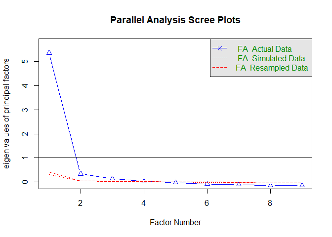<!-- -->

Parallel analysis suggested 3 factors, but only one factor has high
loadings (and explains 0.54 of the variance in the items).

The loadings of the two dichotomous items are lowest. We decided to
remove these items, also because they caused difficulties in estimating
the models in Mplus. This deviation from the preregistration is
documented in `changes.txt`.

For the variable `cnorm`, we just use a latent variable with two
indicators.

## Mean scale scores

Due to problems in model convergence when using measurement models, we
resorted to using mean scale scores for all variables. As can be seen in
the table below, all three scales had good-to-excellent reliability, and
had factor loadings \(\geq .48\) on a single-factor CFA.

| Subscale | Items |    n | mean | sd   | min  | max  | skew   | kurt   | Reliability | Interpret | min\_load | max\_load |
| :------- | ----: | ---: | :--- | :--- | :--- | :--- | :----- | :----- | :---------- | :-------- | :-------- | :-------- |
| rel      |     7 | 7136 | 0.36 | 0.30 | 0.00 | 1.00 | 0.48   | \-1.05 | 0.93        | Excellent | 0.71      | 0.92      |
| cnorm    |     2 | 7136 | 0.41 | 0.26 | 0.00 | 1.00 | 0.25   | \-0.63 | 0.85(sb)    | Good      | 0.86      | 0.86      |
| well     |    16 | 7136 | 3.61 | 0.65 | 1.06 | 5.00 | \-0.64 | 0.20   | 0.91        | Excellent | 0.48      | 0.80      |

# Analyses

We first split the data into a 70% training sample and 30% testing
sample using the preregistered random seed. As preregistered, we used
training sample to make necessary adjustments to the planned analyses.
These changes are documented in `changes.txt`. After the definitive
models have been developed using the training sample, the testing sample
will be used only to obtain unbiased estimates of model fit. This
prevents us from overfitting or p-hacking the training sample.

First, we definitively decided upon the set of models to be compared
based on the training sample. We encountered repeated problems with
model convergence for the planned models. We solved this problem by
using mean scale scores as observed variables in all analyses.
<!--switching to a Bayesian estimator with uninformative priors (a pragmatic use of Bayesian estimation).
Interpretation of Bayesian parameter estimates differs from maximum likelihood estimates.
We report the posterior median, and a 95% highest posterior density interval (HPDI). This is the "narrowest" possible interval that contains 95% of samples from the posterior distribution. It represents the most likely population values of the parameter in question. Results are best interpreted by examining the effect size (correlations and standardized regression coefficients), and the width of the HPDI.
Significance is not a Bayesian concept, but we use the shorthand "significant" to refer to estimates for which less than 5% of the posterior distribution had the opposite sign from the estimate.-->

<!--### Model fit indices were not available for some of the planned models

For some models, the only available fit index was the DIC.
For random slope models, not even the DIC was available.
It was possible to estimate parametric models when omitting the measurement model (all CFAs).
Thus, to select the final model as planned in the preregistration,
we calculated mean scores for all latent variables, and we estimated a set of multilevel path models approximately corresponding to the planned multilevel SEM models.
We selected the best model from the set as our final model,
and then returned to Bayesian estimation for the final model.-->

## Selecting the final model

As per the preregistered procedure, we first developed a series of
models to fit using the training sample. We allowed some researcher
degrees of freedom to account for unforeseen problems, as described
above.

## Validation

Next, we validated these models on the 30% testing sample to obtain
unbiased estimates of model fit. The scale score descriptives of the
validation sample were nearly identical to the training sample, which
suggests that our decisions to drop certain items did not lead to
overfitting (see table below).

| Subscale | Items |    n | mean | sd   | min  | max  | skew   | kurt   | Reliability | Interpret | min\_load | max\_load |
| :------- | ----: | ---: | :--- | :--- | :--- | :--- | :----- | :----- | :---------- | :-------- | :-------- | :-------- |
| rel      |     7 | 3059 | 0.36 | 0.30 | 0.00 | 1.00 | 0.49   | \-1.06 | 0.93        | Excellent | 0.69      | 0.92      |
| cnorm    |     2 | 3059 | 0.42 | 0.26 | 0.00 | 1.00 | 0.27   | \-0.55 | 0.85(sb)    | Good      | 0.86      | 0.86      |
| well     |    16 | 3059 | 3.63 | 0.64 | 1.19 | 5.00 | \-0.64 | 0.28   | 0.91        | Excellent | 0.47      | 0.80      |

### Model selection

We preregistered that we would select the best-fitting model (in the
testing sample) using a combination of BIC statistics, to rank the
models by fit, and likelihood ratio tests. For the BIC statistic, a
lower number indicates better fit. The preference would thus generally
be for the model with the smallest BIC. However, sometimes the
difference between models might be negligible. Therefore, we complement
the BIC with likelihood ratio tests. If two models both have low BICs,
the more parsimoneous model would be preferred. If this model does not
differ significantly from the one with the lowest BIC, then we will
select the more parsimoneous one.

As can be seen in the table below, with increasing complexity, fit
improved significantly until model M3 free.

|   | Title    | Parameters |         LL | LLCorrectionFactor |      AIC |      BIC | LR\_p |
| :- | :------- | ---------: | ---------: | -----------------: | -------: | -------: | :---- |
| 1 | M1 free  |          8 | \-2568.045 |             2.0353 | 5152.090 | 5200.297 |       |
| 3 | M2 fixed |         10 | \-2541.472 |             1.7478 | 5102.944 | 5163.203 | 0.000 |
| 5 | M3 fixed |         11 | \-2529.299 |             1.6406 | 5080.599 | 5146.883 | 0.000 |
| 2 | M2 free  |         12 | \-2540.601 |             1.5459 | 5105.202 | 5177.512 | 1.000 |
| 4 | M3 free  |         14 | \-2528.913 |             1.5349 | 5085.826 | 5170.187 | 0.000 |

According to the plot below, BIC similarly indicated that fit improved
until model M3 fixed. Thus, we decided to use `M3 fixed` as our final
model.

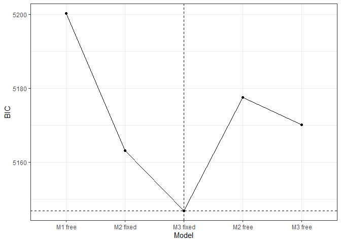<!-- -->

## Final model

The final model was evaluated on the full sample to obtain as much power
as possible, and the results of that analysis are used for inference.

# Results

As preregistered, The general modeling framework is a multilevel model,
because the data are nested (respondents within countries). Our analyses
indicated that the best-fitting model included fixed effects for
religiosity, perceived cultural norms, and the interaction between the
two. The best-fitting model did not include random effects for these
parameters. That means that there was no significant variability across
countries in these effects.

The structural parameters of the final model are displayed in the table
below.

|     | Parameter                 | level   | est\_sig     | se   | pval | confint          |
| :-- | :------------------------ | :------ | :----------- | :--- | :--- | :--------------- |
| 2   | RI (Religiosity)          | Between | 0.25\*\*\*   | 0.02 | 0.00 | \[ 0.20, 0.29\]  |
| 5   | RI (Perceived norms)      | Between | 0.09\*       | 0.04 | 0.01 | \[ 0.02, 0.17\]  |
| 3   | RI (religiosity \* norms) | Between | 0.41\*\*\*   | 0.09 | 0.00 | \[ 0.24, 0.58\]  |
| 4   | Mean (wellbeing)          | Between | \-1.10\*\*\* | 0.10 | 0.00 | \[-1.29, -0.92\] |
| 1   | Variance (wellbeing)      | Between | 0.02\*       | 0.01 | 0.04 | \[ 0.00, 0.04\]  |
| 6   | Control (majority)        | Within  | 0.04         | 0.02 | 0.06 | \[-0.00, 0.07\]  |
| 7   | Control (ses)             | Within  | 0.14\*\*\*   | 0.01 | 0.00 | \[ 0.12, 0.16\]  |
| 8   | Control (gender)          | Within  | \-0.02       | 0.02 | 0.33 | \[-0.06, 0.02\]  |
| 9   | Control (education)       | Within  | 0.03\*\*\*   | 0.00 | 0.00 | \[ 0.02, 0.04\]  |
| 10  | Control (age)             | Within  | 0.00\*\*     | 0.00 | 0.00 | \[ 0.00, 0.00\]  |
| 1.1 | Variance (wellbeing)      | Between | 0.02\*       | 0.01 | 0.04 | \[ 0.00, 0.04\]  |

With regard to the preregistered research questions, we must first
establish whether the relationship between religiosity and well-being
depend on perceived cultural norms of religion (research question *b*).
This interaction is significant, thus we conclude that the effect of
religiosity on wellbeing is dependent on the perceived cultural norms of
religion.

With regard to research question *a*, whether religious people have
higher well-being, we conclude that, on average across the sample,
religiosity positively predicts wellbeing,
\(B = 0.25***, CI[ 0.20, 0.29]\).

Due to the significant interaction between religiosity and perceived
cultural norms of religion, this effect tends to be stronger on average
when individuals perceive greater cultural norms of religion, and weaker
when participants perceive lower cultural norms.

## Sensitivity check

As preregistered, we conducted a sensitivity analysis, re-running the
final model with all participants included.

The table below shows the results from the final model, with an extra
column added with the 95% confidence intervals for a sensitivity
analysis with all participants included (even those who failed the
attention check). Note that these confidence intervals are nearly
identical with the original confidence intervals. We thus conclude that
omitting participants with failed attention checks did not meaningfully
affect the conclusions of the present study.

|     | Parameter                 | level   | est\_sig     | se   | pval | confint          | confint sens     |
| :-- | :------------------------ | :------ | :----------- | :--- | :--- | :--------------- | :--------------- |
| 2   | RI (Religiosity)          | Between | 0.25\*\*\*   | 0.02 | 0.00 | \[ 0.20, 0.29\]  | \[ 0.20, 0.29\]  |
| 5   | RI (Perceived norms)      | Between | 0.09\*       | 0.04 | 0.01 | \[ 0.02, 0.17\]  | \[ 0.02, 0.16\]  |
| 3   | RI (religiosity \* norms) | Between | 0.41\*\*\*   | 0.09 | 0.00 | \[ 0.24, 0.58\]  | \[ 0.26, 0.61\]  |
| 4   | Mean (wellbeing)          | Between | \-1.10\*\*\* | 0.10 | 0.00 | \[-1.29, -0.92\] | \[-1.29, -0.92\] |
| 1   | Variance (wellbeing)      | Between | 0.02\*       | 0.01 | 0.04 | \[ 0.00, 0.04\]  | \[ 0.00, 0.04\]  |
| 6   | Control (majority)        | Within  | 0.04         | 0.02 | 0.06 | \[-0.00, 0.07\]  | \[ 0.01, 0.08\]  |
| 7   | Control (ses)             | Within  | 0.14\*\*\*   | 0.01 | 0.00 | \[ 0.12, 0.16\]  | \[ 0.11, 0.15\]  |
| 8   | Control (gender)          | Within  | \-0.02       | 0.02 | 0.33 | \[-0.06, 0.02\]  | \[-0.05, 0.02\]  |
| 9   | Control (education)       | Within  | 0.03\*\*\*   | 0.00 | 0.00 | \[ 0.02, 0.04\]  | \[ 0.02, 0.04\]  |
| 10  | Control (age)             | Within  | 0.00\*\*     | 0.00 | 0.00 | \[ 0.00, 0.00\]  | \[ 0.00, 0.00\]  |
| 1.1 | Variance (wellbeing)      | Between | 0.02\*       | 0.01 | 0.04 | \[ 0.00, 0.04\]  | \[ 0.00, 0.04\]  |

# Exploratory analyses

In addition to the planned deductive analyses, we conducted an inductive
(exploratory) analysis using random forests, predicting a mean score of
wellbeing from the individual-level predictors. This analysis should
reveal what the most important predictors of wellbeing are in the
dataset provided, and can therefore help contextualize the planned
analyses. Is religion indeed important? Are perceived cultural norms?
How important are they, compared to other measured variables?

The tuned model had an \(R^2_{oob} = 0.28\), which is an estimate of
explained variance in the testing sample. For a flexible model such as
random forests, this predictive performance is quite low. There are
several potential explanations. First, perhaps some crucial predictors
of wellbeing are not included in the sample. For example, the data do
not contain any factors related to quality of social ties. Second, it is
possible that there is a large *irreducible error* in wellbeing: Perhaps
some factors that contribute to wellbeing are outside of the
psychosocial realm, and would thus be overlooked by a study such as
this. Third, perhaps the measurement error of the dependent variable is
high. Despite the excellent reliability of the scale (\(\alpha > .90\)),
we encountered irregularities during factor analysis. Our analysis
assumes that the scale is unidimensional, but some of our analyses
contradict this assumption.

## Variable importance

Variable importance in random forests indicates how strongly each
variable contributes to the model’s predictive performance. It is
determined by comparing the model’s predictive performance before and
after randomly permuting each variable in turn, thereby losing all
information that variable contributes. If the predictive performance
drops substantially after permuting a variable, that variable is
considered to be important.

When examining variable importance (plot below), we see that religiosity
(rel) and perceived cultural norms (cnorm) do not emerge as the most
important predictors of wellbeing in a flexible random forests analysis.
Instead, socio-economic status (ses) appears to be by far the most
important predictor of wellbeing. This is followed by country of
residence, which indicates that there are substantial between-country
differences in wellbeing. We will not delve into each predictor, but it
is noteworthy to point out that whereas some of the most important
predictors were included as covariates in our final multilevel model
(e.g., SES), others were not. Partly, this is due to limits on model
complexity for parametric models. For example, we could not include
denomination or ethnicity, because these categorical variables had too
many categories. Conversely, it is reassuring to note that the attention
check has low variable importance, which validates our previous
sensitivity analysis. Moreover, another variable that could be
considered a candidate for a sensitivity analysis - sample type - was
also found to be relatively unimportant.

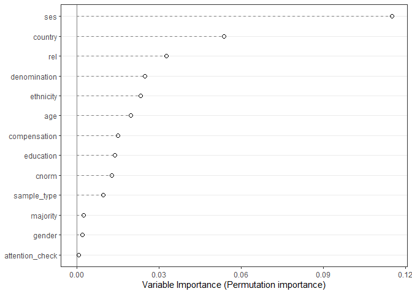<!-- -->

## Partial dependence plots

Partial dependence plots in random forests reveal the marginal bivariate
relationship of each predictor with the outcome, averaging (by Monte
Carlo integration) over all other predictors. We print partial
dependence plots for the most important 10 predictors.

The continuous predictors ses, religiosity (rel), age, and education
show approximately monotonous positive relationships with wellbeing. For
perceived cultural norms (cnorm), the marginal effect appears to be
close to zero.

For the categorical predictors, the effects are difficult to ascertain,
especially because some denominations and ethnicities occur only in
certain countries.

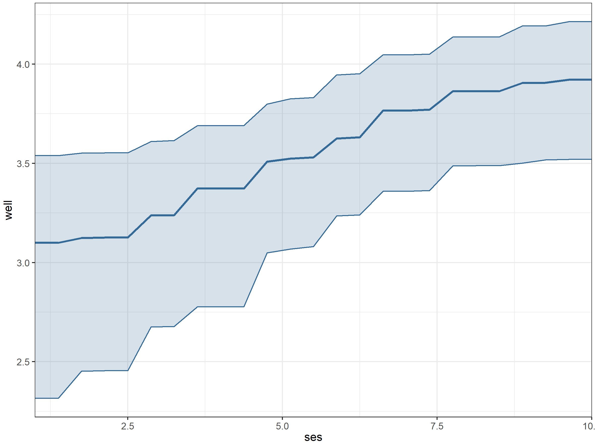<!-- -->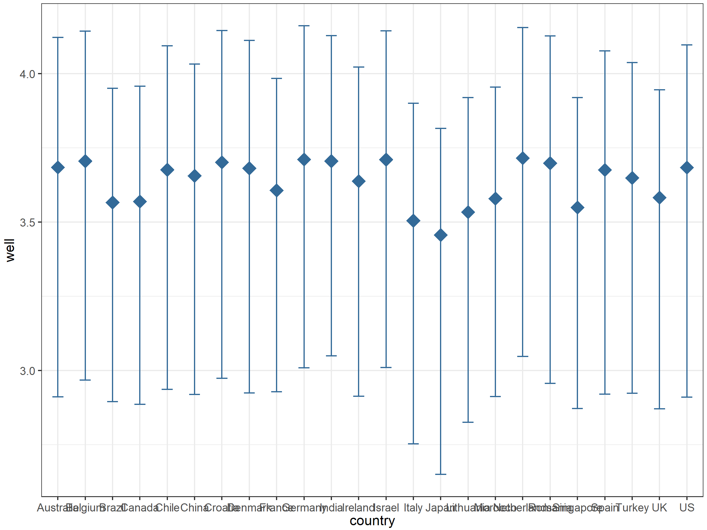<!-- -->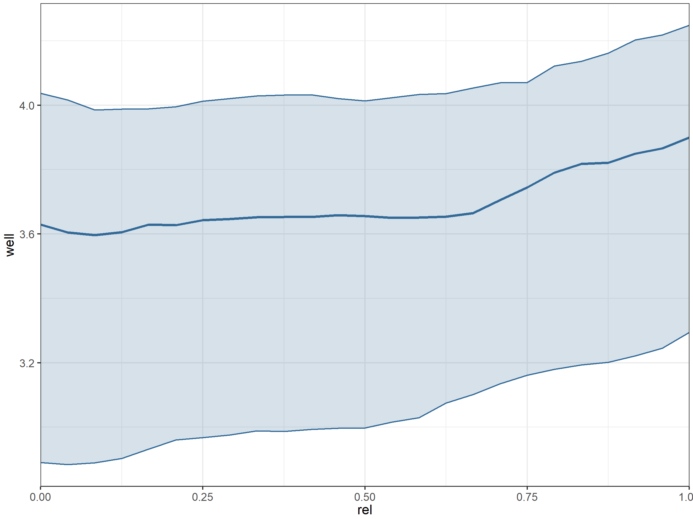<!-- -->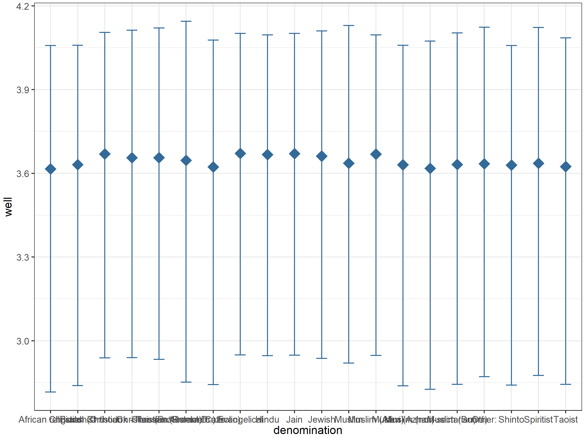<!-- -->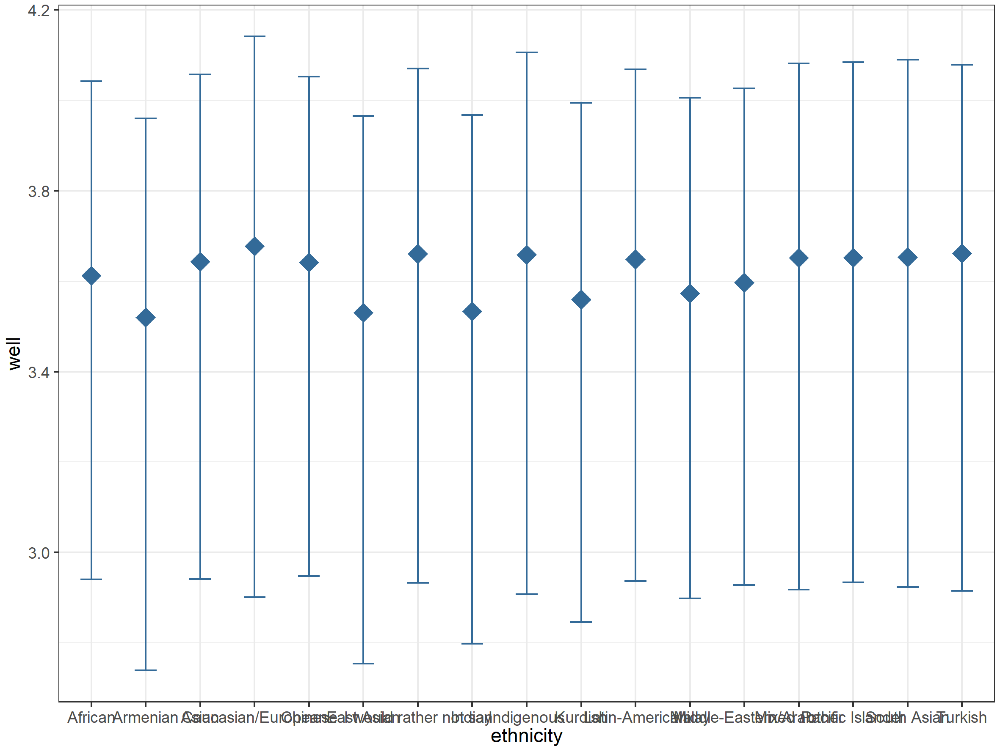<!-- -->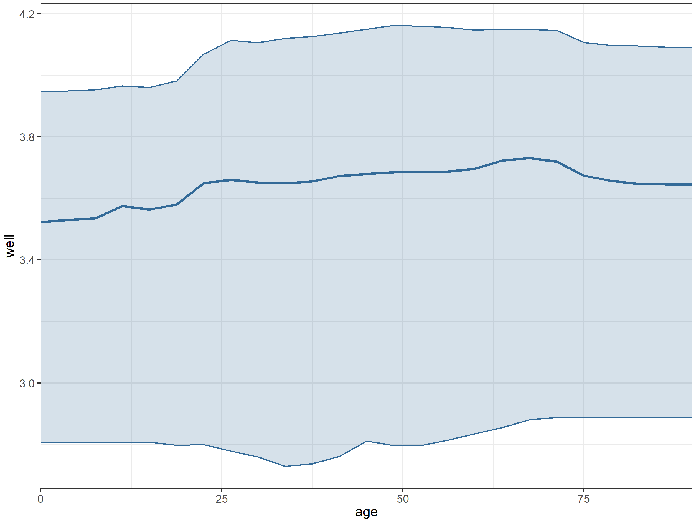<!-- -->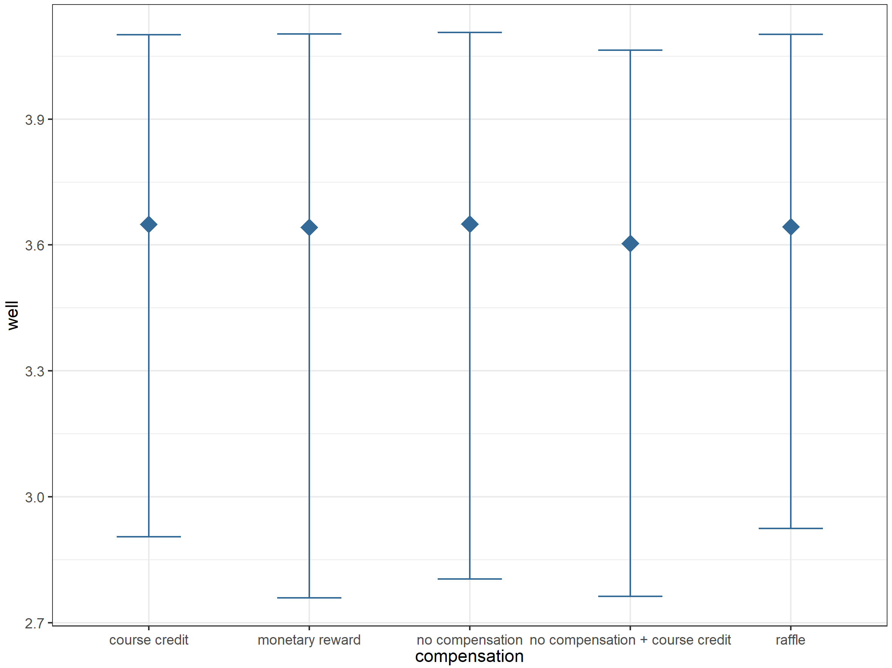<!-- -->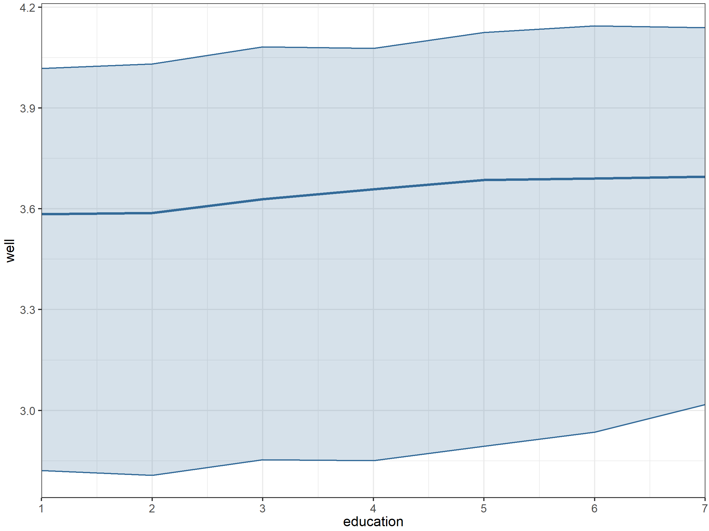<!-- -->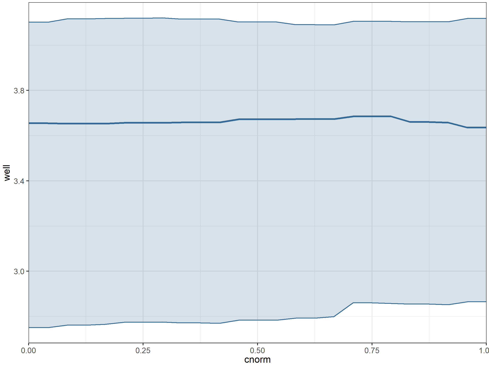<!-- -->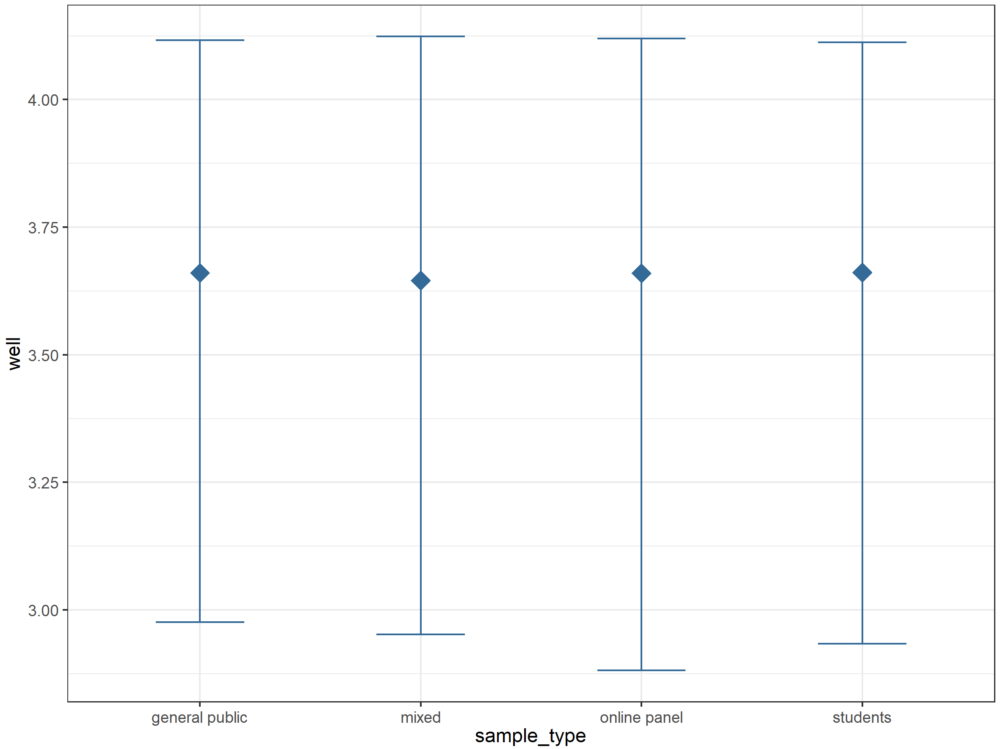<!-- -->

## Bivariate partial dependence

For the hypothesized interaction between religiosity and perceived
cultural norms, we examine a bivariate partial dependence plot. We used
a heatmap to visualize this three-dimensional relationship (see below).
Based on this plot, there is limited evidence for an interaction between
religiosity and perceived cultural norms, when averaging across all
other variables.

<!-- -->

# References

Stekhoven, D.J. and Buehlmann, P. (2012). ‘MissForest - nonparametric
missing value imputation for mixed-type data’, Bioinformatics, 28(1)
2012, 112-118. <https://doi.org/10.1093/bioinformatics/btr597>.

Van Lissa, C. J., Brandmaier, A. M., Brinkman, L., Lamprecht, A.-L.,
Peikert, A., Struiksma, M. E., & Vreede, B. (in press). WORCS: A
Workflow for Open Reproducible Code in Science. Data Science, in press.
<https://doi.org/10.17605/OSF.IO/ZCVBS>

Van Lissa, Caspar J., Andreas M. Brandmaier, Barbara Vreede, Rens van de
Schoot, and Loek Brinkman. 2020. “WORCS: A Workflow for Open
Reproducible Code in Science,” February.
<https://doi.org/10.17605/OSF.IO/ZCVBS>.

